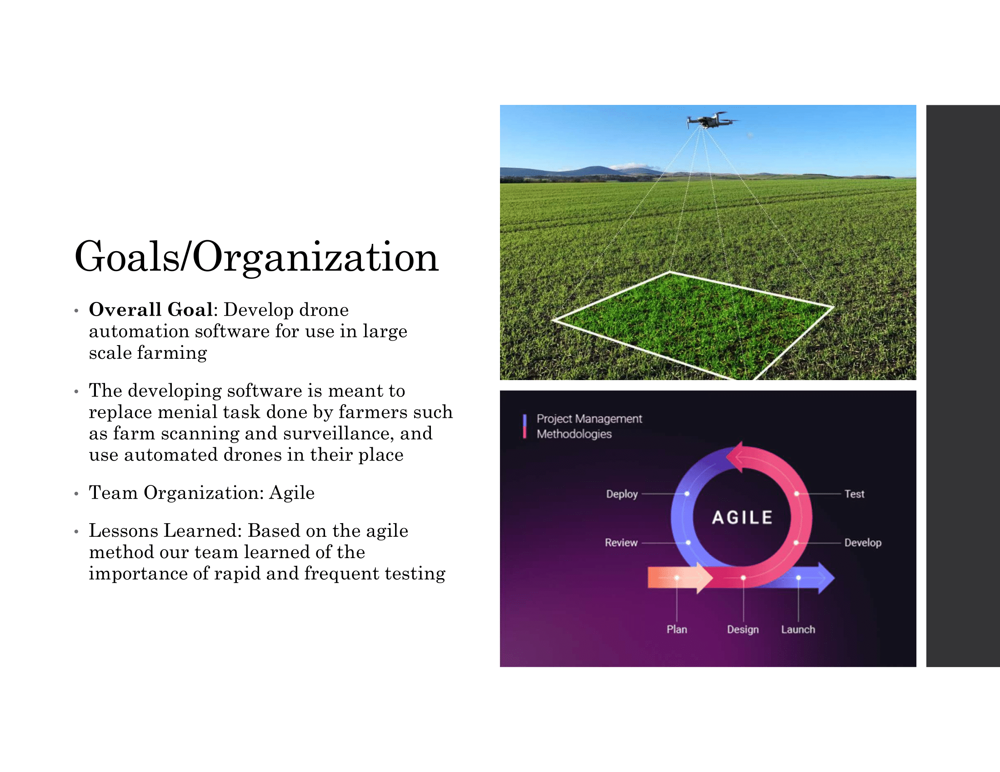
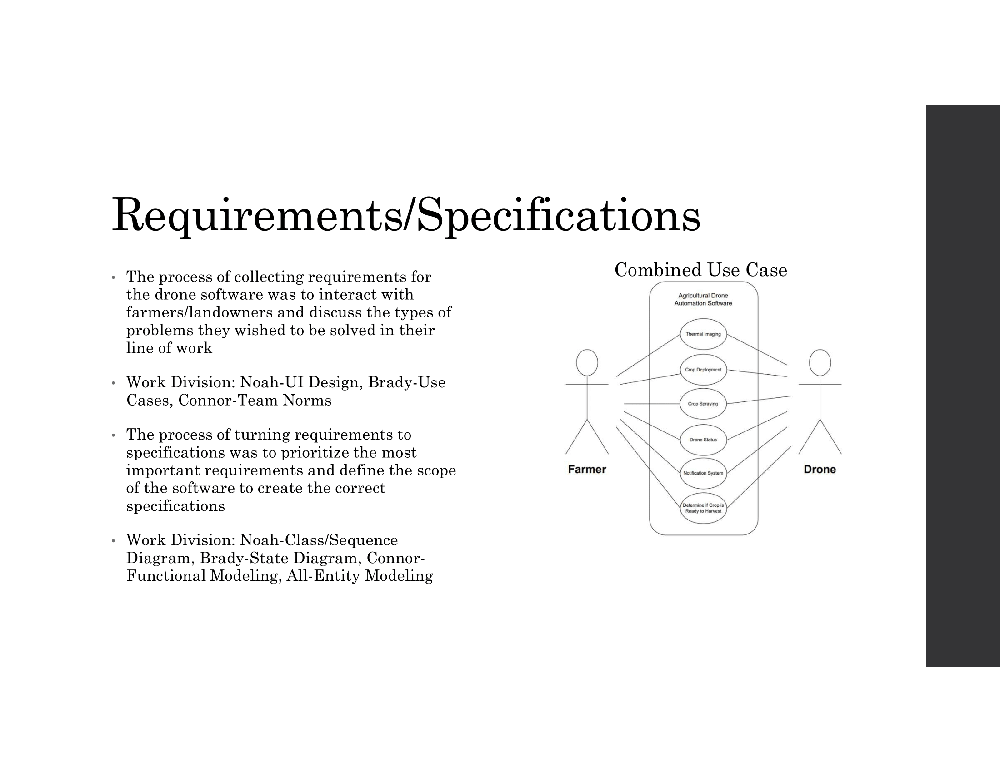
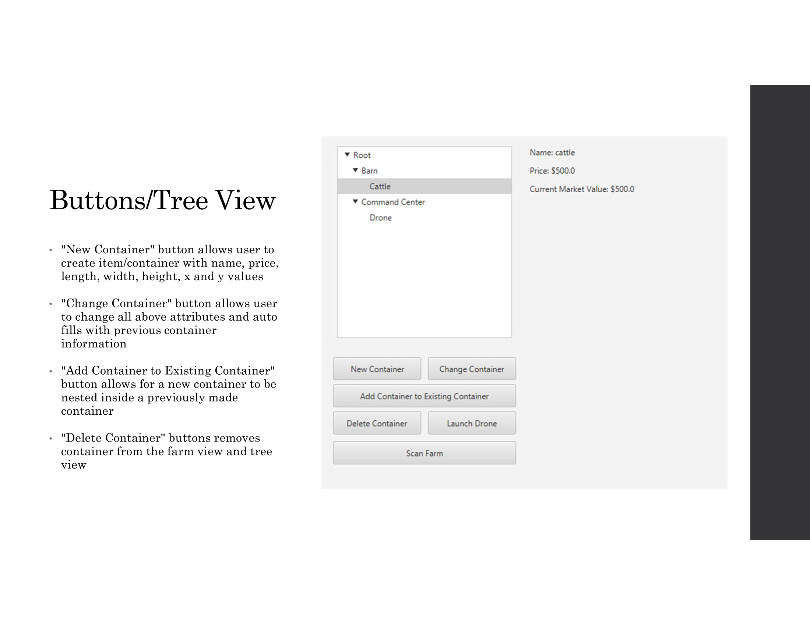
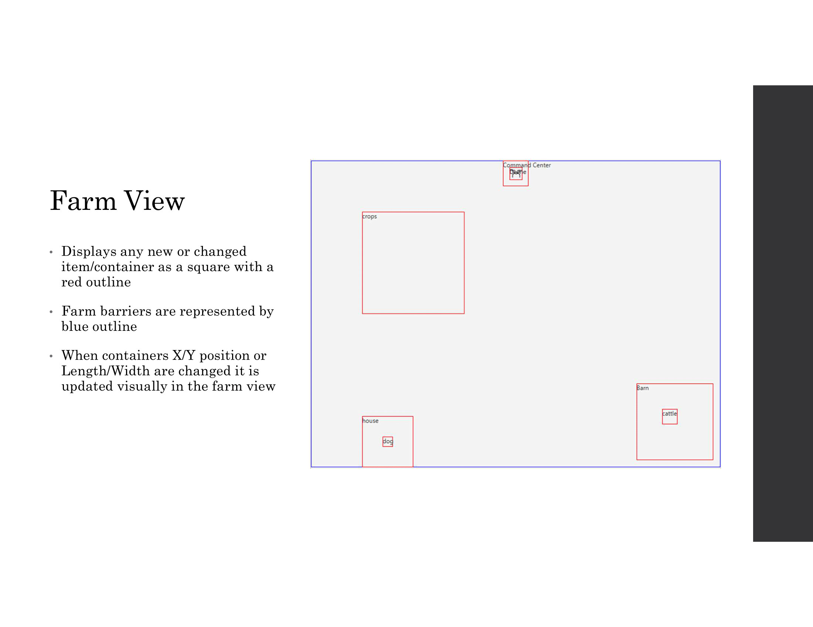
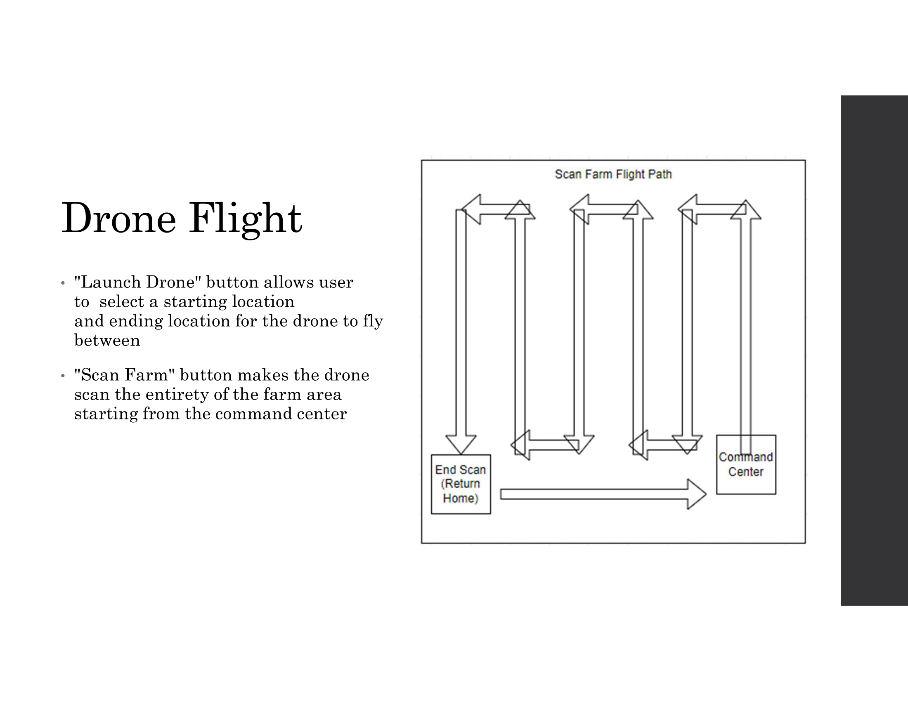
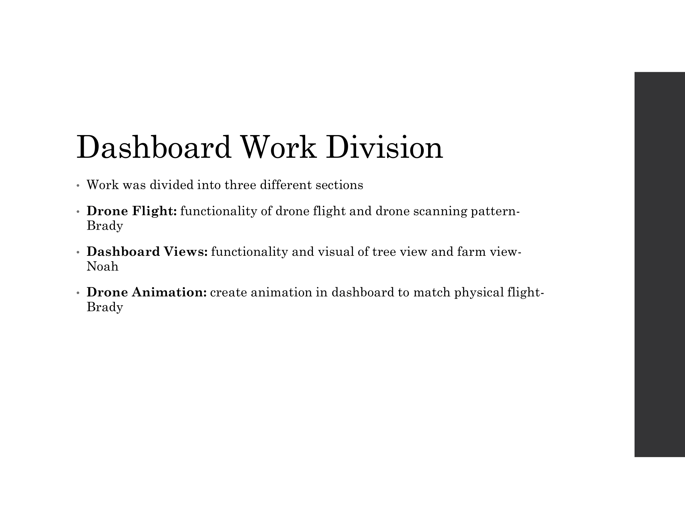
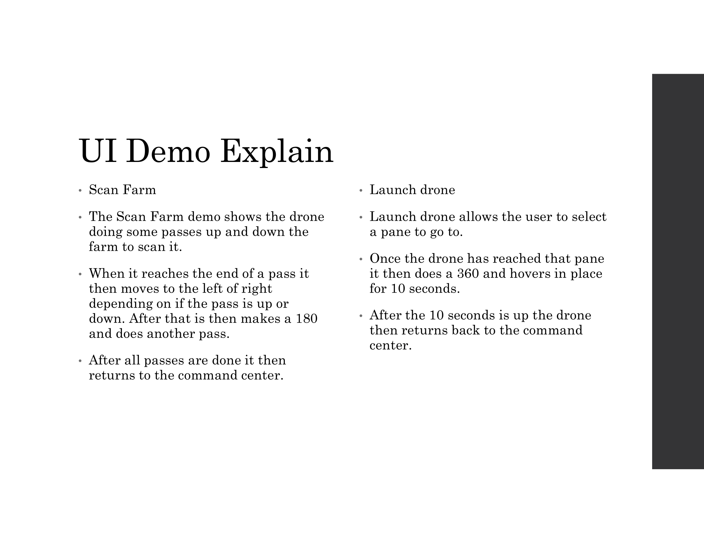
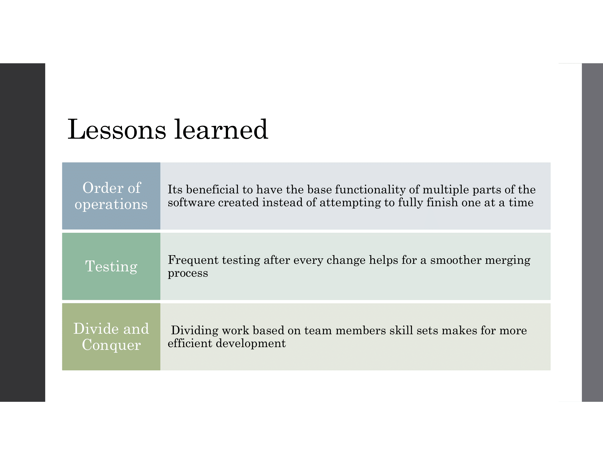

# A Farm Drone Project

## Introduction
This project is a Java based done project for a UAB class. The goal of this project was to make a ui and use a tello drone to fly to an area and return to the command center location. It also has a scan function where the drone scans up and down the area. 

## To download
	- Click the Code button above and a drop down will open
	- Click the download zip and a zip will download
	- Extract the zip 
	
## To Run
	- You nust have jdk 20 installed to be able to run 
		-- https://www.oracle.com/java/technologies/javase/jdk20-archive-downloads.html
	- Double click the LaunchDrone.bat
	- A terminal will open and the program should start

	- If the .bat does not work for you for some reason you wil need to download and install intellij
		-- https://www.jetbrains.com/idea/download/?section=windows
		-- You can get the Community Edition for free just scroll down
	- The file you need to launch is FarmDashboard.java
		-- FarmDashboard/src/main/java/com/example/farmdashboard/FarmDashboard.java
	- If your pc is missing an dependicy make sure to download and install the ones it says you need
	- If everything is installed and downloaded properly you can launch the file 
	- Then a new window will open

## UI Demo Video
	- https://youtu.be/Fn_1_kLptX4
	
## Technologies
	- Java: We used this becuase it was a requirement.
	- JavaFX: Also a requirement.
	- Github: We used this because it was a requirement, also to store and collaborate on the project. 
	- Batchfile: Used this to try to make it so you can launch the drone application without needing to use and IDE.

## Slides

